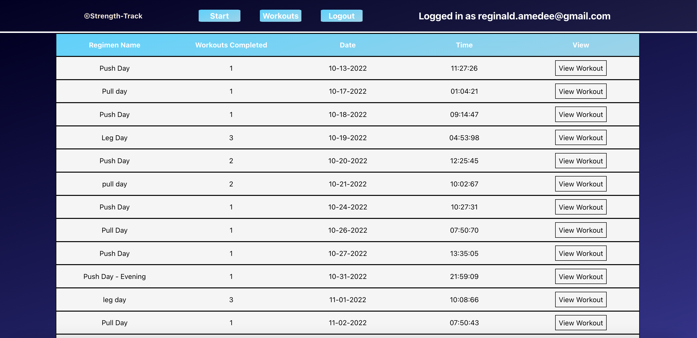

# Calisthenics Prime
An app that tracks your calisthenics journey ! Supercharge your workouts with data driven tracking while documenting your journey with calisthenics. Users will be able to set weekly goals for specific workouts. You can adjust your workout based on the intensity that you want to have. Compare your journey by a given time frame with the goal that you previously set for yourself.

## Features
* User Registration
* Create Circuit Workouts
* Log workouts 
* View them in a dashboard

### User Cannot Access App Without Token

### User Registration

### Create Circuit Workouts

### Log Workouts

### View Them In Dashboard

[Live Web App](https://shielded-citadel-69871.herokuapp.com/)

## Installation
* Form and clone this repository
* Install NPM packages by running npm install
* Run npm start to open the application in your browser

## Technologies Used 

Utilized a MERN stack to build app
* MongoDB/Mongoose
* Express.js
* React.js
* Node.js

Other Technologies Used
* Redux Toolkit
* Axios
* Heroku
* Redux Toolkit

## Planning Process
* Started with back-end application then worked on the front-end
* Created new feature branches for each stage of development

# Stay Connected
I am Reginald Jean Amedee, a full-stack software engineer and web developer. Thank you for checking out my work. You can reach out to me at @jeantechnical1992@gmail.com or you can follow me on [Linkedin](https://www.linkedin.com/in/reginaldamedee/)

